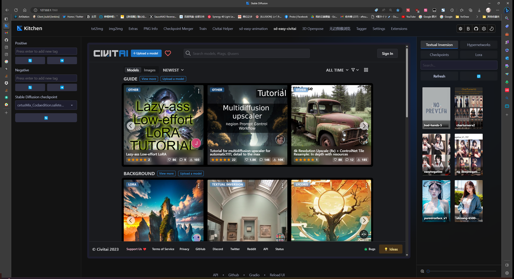

# sd-easy-animation WIP
a project for making animation in stable diffusion easier

### Feature

1. Add Civitai to sd webui

2. Video Timeline Editor (WIP)

Todo list:

> support img2img

> support controlnet

> support single frame inpaint

> support frame2video

> others.....
